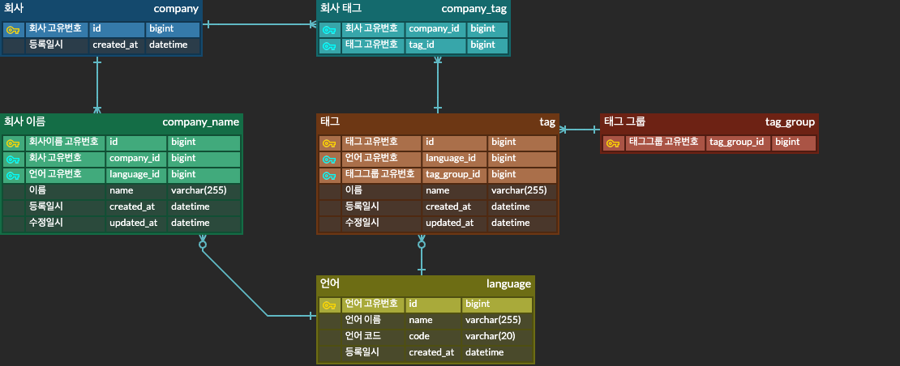

# multilingual-company-name
다국어 회사명 관리 프로젝트

## 기능

> ✅ 전체 요구사항 구현 완료 및 개발 조건 충족

### 요구 사항 
- 회사명 자동완성
    - 회사명의 일부만 들어가도 검색이 되어야 합니다.
    
- 회사 이름으로 회사 검색
- 태그명으로 회사 검색
    - 태그로 검색 관련된 회사가 검색되어야 합니다.
    - 다국어로 검색이 가능해야 합니다.
        - 일본어 태그로 검색을 해도 한국 회사가 노출이 되어야 합니다.
        - タグ_4로 검색 했을 때, 원티드랩 회사 정보가 노출이 되어야 합니다.
    - 동일한 회사는 한번만 노출이 되어야합니다.

- 회사 태그 정보 추가
- 회사 태그 정보 삭제

### 개발 조건
- Python Flask 또는 FastAPI 이용하여 개발
- Test Case 통과
- ORM 사용
- 결과는 JSON 형식으로 반환
- Database RDB 사용
- Docker 사용


### 주요 기능

- 회사명 자동 완성 기능
- 회사이름 또는 다국어 태그 이름을 기반으로 회사 검색
- 다국어로 회사명을 포함하여 새로운 회사 추가
- 회사에 대한 태그 추가, 수정 및 삭제
- 태그를 그룹으로 관리

## API

프로젝트가 설정된 후에는 다음 엔드포인트를 통해 기능을 테스트할 수 있습니다.

자세한 내용은 API 문서 (Swagger) 참고 부탁드립니다.

#### 회사

- **회사명 자동완성**: `GET /search`
- **회사 이름으로 회사 검색**: `GET /companies/{company_name}`
- **새로운 회사 추가**: `POST /companies`
- **태그명으로 회사 검색**: `GET /tags`
- **회사 태그 정보 추가**: `PUT /companies/{company_name}/tags`
- **회사 태그 정보 삭제**: `DELETE /companies/{company_name}/tags/{tag_name}`

### 사용 기술 스택

- **백엔드**: Python 3.11 FastAPI 0.114.2 SQLAlchemy 2.0.34
- **데이터베이스**: MySQL 8.0.39
- **컨테이너화**: Docker, Docker Compose

### ERD



---

## 시작하기

로컬 환경에서 프로젝트를 설정하고 실행하기 위한 단계는 다음과 같습니다.

### 사전 준비

- Git, Docker 및 Docker Compose가 설치되어 있어야 합니다.
- Docker Desktop 앱이 설치 및 **실행**되고 있어야 합니다.
  - [https://www.docker.com/products/docker-desktop/](https://www.docker.com/products/docker-desktop/)
- 프로젝트 최상위 디렉토리에 `.env` 파일을 생성해주세요.
  ```
  MYSQL_HOST=mysqldb
  MYSQL_PORT=3306
  MYSQL_USER=user
  MYSQL_PASSWORD=user123
  MYSQL_DATABASE=app
  MYSQL_ROOT_PASSWORD=root123
  ```


### 설치 및 설정

1. **git clone 후 프로젝트 디렉토리로 이동**:

    ```bash
    git clone https://github.com/leeyongjo-o/multilingual-company-name.git
    cd multilingual-company-name
    ```

2. **Docker Compose 실행**:

    - 관리자 권한으로 명령어를 실행하여 Docker 컨테이너를 빌드하고 실행합니다.
      - -d: 백그라운드 실행

    ```bash
    sudo docker-compose up --build
    ```

    - 다음과 같은 서비스가 설정됩니다:
        - **Web**: FastAPI 애플리케이션 (Port: 8000)
        - **Database**: MySQL 데이터베이스 및 초기 데이터 (Port: 3306)

3. **애플리케이션 접속**:

    - API 문서는 [http://localhost:8000/docs](http://localhost:8000/docs) 에서 확인할 수 있습니다.

4. **Docker Compose 종료**:
   - 테스트 완료 후 Docker 컨테이너를 종료합니다.
   - `Ctrl + C` 입력 또는 명령어를 실행 (백그라운드 실행 시) 
     - -v: 볼륨 삭제
     ```
     docker-compose down
     ```
     
### 기타

- 테스트 코드 파일 (test_senior_app.py) 수정
    > FastAPI 환경에 맞게 수정
  - import문
      - 추가: `from fastapi.testclient import TestClient`
  - 코드 변경
      - `app.test_client()` → `TestClient()`
      - `from app import app` → `from main import app`